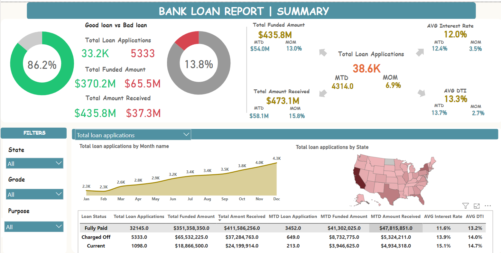
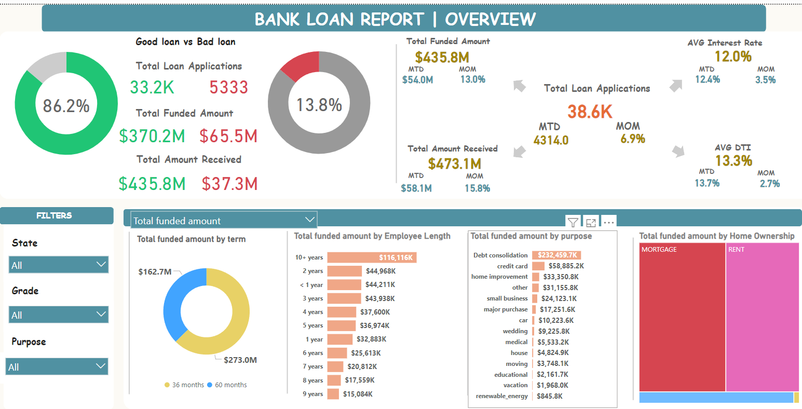
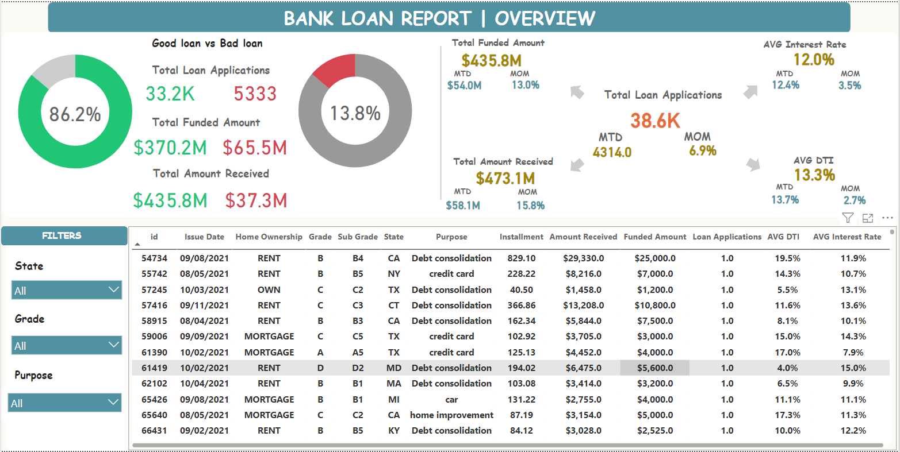

# Bank Loan Analysis Dashboard 
## Overview 
This project is a Bank Loan Analysis Dashboard built with Power BI, designed to provide insights into loan performance, funded amounts, and user demographics across multiple dimensions. The dashboard visualizes data on loan applications, funding, interest rates, and other key metrics to help identify trends and performance indicators in loan processing and collections.

## Features 
## 1. Good vs. Bad Loan Analysis 
Key Metrics:  
Total Loan Applications (segregated as Good and Bad)   
Total Funded Amount (Good vs. Bad Loans)   
Total Amount Received (Good vs. Bad Loans)   
Visualization: Pie chart showing the percentage of Good and Bad loans for quick visual assessment.   
## 2. Key Performance Indicators (KPIs) 
Total Loan Applications: Displays overall loan applications with month-to-month (MoM) growth.   
Total Funded Amount: Shows monthly funded amounts with MoM growth.   
Total Amount Received: Tracks monthly amount received with MoM comparison.   
Average Interest Rate: Highlights interest rate trends with MoM changes.   
Average Debt-to-Income (DTI) Ratio: Presents the average DTI and its MoM fluctuation.   
## 3. Filter Options 
State: Allows filtering of data by state to analyze regional performance.   
Grade: Provides insights by loan grade to examine credit quality and its impact.   
Purpose: Enables filtering by loan purpose (e.g., debt consolidation, mortgage, credit card).   
## 4. Visualizations 
Loan Applications Over Time: Line chart showing loan applications by month, highlighting seasonal trends.   
Applications by State: Map visual providing geographical insights on loan applications by state.   
Funded Amount by Loan Term: Breakdown of funded amounts by loan term (e.g., 36 or 60 months).   
Funded Amount by Employment Length: Bar chart indicating the relationship between loan amounts and borrower employment length.   
Funded Amount by Purpose: Visualization categorizing loans by purpose, such as debt consolidation or home improvement.   
Funded Amount by Home Ownership: Analysis of loan amounts by home ownership type (mortgage, rent, own).   
## 5. Detailed Data Table 
Loan Breakdown: Table with details on individual loans, including ID, issue date, grade, purpose, installment, funded amount, and other key metrics.     
## Calculated Fields   
The dashboard includes a range of calculated fields, such as:  
Average DTI  
Average Interest Rate  
Good/Bad Loan Applications and Amounts  
Month-over-Month (MoM) Changes for Amount Received, Funded Amount, and Interest Rate  
Month-to-Date (MTD) Metrics for Amount Received, Average Interest Rate, and Loan Applications  
These fields enable detailed trend analysis and highlight monthly changes in key financial metrics.  

## Technology Stack
Power BI: For data visualization and dashboard creation.  
Excel and SQL: ETL  

                                   

 

  
